# ION Architecture

## Setup

### Git Hooks

This repo uses a pre-push hook that runs an AI security audit via the Claude CLI before every push. To enable it:

```sh
git config core.hooksPath .githooks
```

Requirements:
- [Claude CLI](https://docs.anthropic.com/en/docs/claude-code) installed and on PATH

The hook reads the audit prompt from `frontend/.claude/commands/security-audit.md` and blocks the push if any critical or high severity findings are detected. To bypass in an emergency: `git push --no-verify`.

---



#### ! For a more in depth overview read: [ION Architecture Research](./ion_infrastructure_research.md)

## ION Connect Proxy
A fork of TON Proxy that forms the encrypted overlay network all client applications connect through. It runs in two modes: a client-side entry proxy that accepts standard HTTP/HTTPS requests and translates them into ADNL/RLDP traffic over UDP, and a server-side reverse proxy that receives overlay traffic and forwards it to internal ION services. Beyond tunneling, it is also responsible for service discovery — providing clients with the closest available ION Connect Proxy instances to minimize latency. Client apps must run the client portion of this proxy locally to gain access to the private overlay and resolve `.ion` domains via the forked ION DNS system!

## ION BNB Greenfield Proxy
A reverse proxy that sits inside the overlay network and forwards client traffic to the BNB Greenfield storage system. Rather than having client apps communicate with Greenfield Storage Providers directly over the public internet, all Greenfield interactions (file uploads, object creation, bucket management) are tunneled through the overlay via this proxy. This keeps the client's connection to the storage backend private and routed through the encrypted ADNL transport layer, while the proxy itself handles the standard HTTPS REST API calls to Greenfield SPs on the other side.

## ION Connect Storage
A fork of TON Storage augmented with an LRU (Least Recently Used) caching layer. It serves as a read-path cache for files stored on BNB Greenfield: when a client requests a file, if it doesn't exist on the node's local disk, the service downloads it from Greenfield and assigns a TTL (e.g. 1 day). If the file isn't requested again within that TTL window, it is evicted from local storage. Subsequent requests re-trigger the download from Greenfield. This creates a distributed caching mesh across multiple nodes, reducing redundant Greenfield fetches and lowering read latency for frequently accessed content while avoiding permanent local storage bloat.

## ION Connect CDN
A service that listens to all file upload events on the BNB Greenfield system, filters for media files (images, videos), and replicates them to a CDN provider such as Bunny CDN. This bridges the  storage backend with high-performance edge delivery — media-heavy content like profile pictures, post images, and video attachments are served to clients from geographically distributed CDN PoPs rather than requiring a Greenfield fetch or overlay hop for every request. The service operates autonomously by monitoring Greenfield's on-chain `EventSealObject` events and uploading matching media to the CDN.

## ION Connect Indexer
A service that listens to all file upload events on BNB Greenfield and filters for JSON files representing ION Connect events. It ingests these events into a PostgreSQL database where they are parsed, indexed, and made queryable through the custom NOSTR extension protocol called ION Connect. Client apps query the Indexer directly (via the overlay) for social data — feeds, posts, reactions, profiles, chat messages — instead of scanning raw Greenfield storage. The Indexer effectively transforms flat file-based ION Connect event storage into a structured, filterable, real-time queryable backend that supports the subscription and filter semantics of the ION Connect protocol.

## ION Connect UGC NFT Generator
A service that monitors BNB Greenfield upload events and filters for specific ION Connect event types representing valuable user-generated content: posts, long-form articles, videos, and profile records. For qualifying content, it mints NFTs on the ION blockchain, creating on-chain proof of authorship and ownership. The resulting NFT metadata is then inserted into a PostgreSQL database managed by ION Identity, making it queryable alongside user account data. Client apps do not interact with this service directly — users simply see the minted NFTs appear in their wallets as tokenized representations of their content.

## ION Identity
A service that handles user account management, authentication, and wallet infrastructure. It proxies DFNS.co's MPC wallet-as-a-service API to provide seedless, passkey-authenticated wallet access across multiple blockchains — users authenticate via FIDO2/WebAuthn biometrics rather than managing seed phrases. Beyond wallets, it provides convenience features including unique username registration, verified badges, two-factor authentication, coin/token statistics (synced from CoinGecko), and the account data layer that ties together a user's identity across the platform. All wallet operations (creation, transfers, transaction signing) flow through this service.

